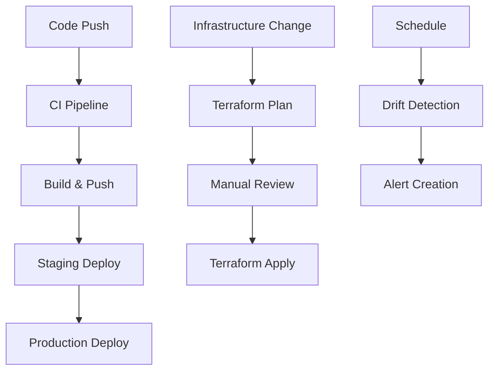

# GitHub Actions Workflows Documentation

## Overview

This directory contains the complete CI/CD pipeline for the OpsSight DevOps Visibility Platform, implementing automated testing, building, security scanning, and deployment to AWS EKS infrastructure.

## Workflow Architecture

### 🔍 CI Pipeline (`ci.yml`)
**Triggers:** Pull requests, pushes to main/develop branches
- **Frontend CI**: Linting, testing, type checking, building
- **Backend CI**: Python code quality, security scanning, testing
- **Infrastructure CI**: Terraform validation and formatting
- **Security Scanning**: Vulnerability scanning and dependency checks
- **Docker Build Tests**: Multi-platform container building

### 🐳 Build and Push (`build-and-push.yml`)
**Triggers:** Pushes to main/develop, tags, manual dispatch
- **Container Building**: Multi-architecture Docker images (amd64/arm64)
- **Registry Push**: Automated push to AWS ECR
- **Security Scanning**: Container vulnerability scanning
- **Image Signing**: Cosign-based container signing
- **SBOM Generation**: Software Bill of Materials creation

### 🚀 Staging Deployment (`deploy-staging.yml`)
**Triggers:** Successful build completion, manual dispatch
- **Pre-deployment Validation**: Image verification and change detection
- **Database Migration**: Automated schema updates
- **Rolling Deployment**: Zero-downtime Kubernetes deployments
- **Health Checks**: Comprehensive service validation
- **Smoke Testing**: Basic functionality verification

### 🌟 Production Deployment (`deploy-production.yml`)
**Triggers:** Version tags (v*), manual dispatch with approval
- **Semantic Versioning**: Enforced production version tagging
- **Manual Approvals**: GitHub environment protection rules
- **Database Backup**: Pre-deployment backup creation
- **Maintenance Mode**: Optional maintenance page activation
- **Blue-Green Strategy**: Safe production deployments
- **Rollback Capability**: Deployment backup and restore

### 🏗️ Infrastructure Management (`infrastructure.yml`)
**Triggers:** Infrastructure changes, schedule (drift detection), manual dispatch
- **Terraform Automation**: Plan, apply, and destroy operations
- **Drift Detection**: Daily infrastructure state monitoring
- **PR Integration**: Terraform plan comments on pull requests
- **State Management**: S3 backend with DynamoDB locking
- **Environment Protection**: Production infrastructure safeguards

## Environment Configuration

### GitHub Secrets Required

#### AWS Configuration
```yaml
AWS_ROLE_TO_ASSUME: arn:aws:iam::ACCOUNT:role/GitHubActionsRole
AWS_REGION: us-west-2
ECR_REGISTRY: ACCOUNT.dkr.ecr.REGION.amazonaws.com
```

#### Terraform State Management
```yaml
TF_STATE_BUCKET: opsight-terraform-state
TF_STATE_LOCK_TABLE: opsight-terraform-locks
```

#### Container Registry
```yaml
ECR_REGISTRY: 123456789012.dkr.ecr.us-west-2.amazonaws.com
```

### Environment Protection Rules

#### Staging Environment
- **Automatic deployment** from main branch
- **Review required** for manual deployments
- **Deployment timeout**: 30 minutes

#### Production Environment
- **Required reviewers**: DevOps team members
- **Deployment branches**: Tags only (v*)
- **Wait timer**: 5 minutes minimum
- **Deployment timeout**: 60 minutes

## Workflow Dependencies



## Security Features

### Container Security
- **Trivy scanning** for vulnerabilities
- **Semgrep SAST** for code security
- **Cosign signing** for image integrity
- **SBOM generation** for supply chain transparency

### Infrastructure Security
- **OIDC authentication** for AWS access
- **IAM role assumption** with minimal permissions
- **Encrypted state storage** in S3
- **DynamoDB state locking** for concurrency control

### Deployment Security
- **Image verification** before deployment
- **Semantic versioning** enforcement for production
- **Manual approval gates** for critical operations
- **Rollback capabilities** for failed deployments

## Monitoring and Alerting

### Workflow Monitoring
- **GitHub Actions native monitoring**
- **Slack/Teams notifications** (configurable)
- **Email alerts** for failed deployments
- **Deployment status tracking**

### Infrastructure Monitoring
- **Daily drift detection**
- **Automated issue creation** for alerts
- **CloudWatch integration** via EKS
- **AWS Config rules** for compliance

## Best Practices Implemented

### Cursor Development Standards
- **File size limits**: All workflows under 500 lines
- **Comprehensive documentation**: Inline comments with reasoning
- **Error handling**: Proper failure modes and rollback
- **Modular design**: Separated concerns and reusable components

### CI/CD Best Practices
- **Fail-fast principle**: Early detection of issues
- **Parallel execution**: Optimized workflow performance
- **Artifact management**: Proper build artifact handling
- **Environment parity**: Consistent staging and production

### Security Best Practices
- **Least privilege access**: Minimal required permissions
- **Secret management**: Proper secret handling and rotation
- **Supply chain security**: Image signing and verification
- **Audit logging**: Comprehensive operation tracking

## Troubleshooting Guide

### Common Issues

#### 1. AWS Authentication Failures
```bash
Error: could not retrieve caller identity
```
**Solution**: Verify OIDC role trust relationship and permissions

#### 2. Docker Build Failures
```bash
Error: failed to solve: executor failed running
```
**Solution**: Check Dockerfile syntax and build context

#### 3. Kubernetes Deployment Failures
```bash
Error: deployment "app" exceeded its progress deadline
```
**Solution**: Check resource limits and cluster capacity

#### 4. Terraform State Lock Issues
```bash
Error: resource temporarily unavailable
```
**Solution**: Manual state unlock or DynamoDB table check

### Debugging Commands

#### View Workflow Logs
```bash
gh run list --workflow=ci.yml
gh run view <run-id> --log
```

#### Check Kubernetes Status
```bash
kubectl get pods -n staging
kubectl describe deployment <deployment-name>
kubectl logs -f deployment/<deployment-name>
```

#### Terraform State Management
```bash
terraform state list
terraform state show <resource>
terraform force-unlock <lock-id>
```

## Maintenance and Updates

### Regular Maintenance Tasks
- **Weekly**: Review failed workflow runs
- **Monthly**: Update action versions and dependencies
- **Quarterly**: Review and update security policies
- **Annually**: Comprehensive workflow optimization review

### Version Updates
- **GitHub Actions**: Use Dependabot for action updates
- **Docker Images**: Regular base image updates
- **Terraform Providers**: Scheduled provider updates
- **Kubernetes**: Cluster and workload version management

### Performance Optimization
- **Cache strategies**: Optimize build and dependency caching
- **Parallel execution**: Maximize concurrent job execution
- **Resource allocation**: Right-size runner and cluster resources
- **Workflow efficiency**: Regular performance profiling

## Support and Documentation

### Additional Resources
- [GitHub Actions Documentation](https://docs.github.com/en/actions)
- [AWS EKS Best Practices](https://aws.github.io/aws-eks-best-practices/)
- [Terraform AWS Provider](https://registry.terraform.io/providers/hashicorp/aws/latest/docs)
- [Docker Best Practices](https://docs.docker.com/develop/dev-best-practices/)

### Contact Information
- **DevOps Team**: devops@opsight.com
- **Security Team**: security@opsight.com
- **On-call Support**: Slack #devops-alerts

---

*This documentation follows cursor development standards and is maintained as part of the OpsSight DevOps Platform.* 