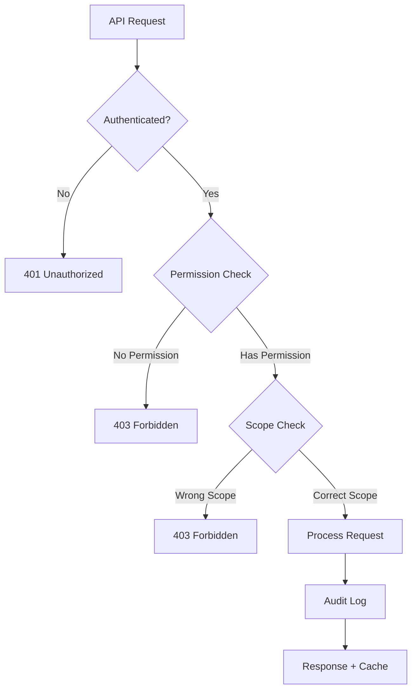

# OpsSight API - RBAC Permissions Reference

## Overview

The OpsSight DevOps Platform API implements a comprehensive Role-Based Access Control (RBAC) system that secures all endpoints with fine-grained permissions. This guide provides a complete reference for all RBAC permissions and their usage across API endpoints.

## 🔑 Permission Types

### Core Permissions

| Permission | Description | Scope | Typical Roles |
|------------|-------------|-------|---------------|
| `VIEW_ROLES` | View roles and permissions | System | All authenticated users |
| `MANAGE_ROLES` | Create, update, delete roles | System | Admins, DevOps Leads |
| `VIEW_USERS` | View user information | System | Managers, Admins |
| `MANAGE_USERS` | Create, update, delete users | System | Admins |
| `VIEW_TEAMS` | View team information | Organization | Team members, Managers |
| `MANAGE_TEAMS` | Create, update, delete teams | Organization | Managers, Admins |

### Infrastructure Permissions

| Permission | Description | Scope | Typical Roles |
|------------|-------------|-------|---------------|
| `VIEW_KUBERNETES` | View Kubernetes resources | Cluster | Engineers, DevOps |
| `MANAGE_KUBERNETES` | Deploy, manage K8s resources | Cluster | DevOps Engineers |
| `VIEW_INFRASTRUCTURE` | View Terraform state/resources | Environment | Engineers, Managers |
| `MANAGE_INFRASTRUCTURE` | Provision infrastructure | Environment | DevOps Engineers |
| `VIEW_AUTOMATION` | View Ansible playbooks/configs | System | Engineers |
| `MANAGE_AUTOMATION` | Execute automation tasks | System | DevOps Engineers |

### Pipeline & Monitoring Permissions

| Permission | Description | Scope | Typical Roles |
|------------|-------------|-------|---------------|
| `VIEW_PIPELINES` | View CI/CD pipeline status | Project | Developers, Engineers |
| `MANAGE_PIPELINES` | Create, modify, run pipelines | Project | DevOps Engineers |
| `VIEW_MONITORING` | View metrics and dashboards | System | All technical users |
| `VIEW_ALERTS` | View alert configurations | System | Engineers, Managers |
| `MANAGE_ALERTS` | Configure alert rules | System | DevOps Engineers |

### Administrative Permissions

| Permission | Description | Scope | Typical Roles |
|------------|-------------|-------|---------------|
| `ADMIN_READ` | Access admin monitoring data | System | Administrators |
| `ADMIN_WRITE` | Perform admin operations | System | Super Administrators |
| `VIEW_COST_ANALYSIS` | View cost reports | Organization | Managers, Admins |
| `MANAGE_COST_ANALYSIS` | Configure cost tracking | Organization | Financial Admins |

### Communication Permissions

| Permission | Description | Scope | Typical Roles |
|------------|-------------|-------|---------------|
| `VIEW_NOTIFICATIONS` | View notification settings | User/Organization | All users |
| `MANAGE_NOTIFICATIONS` | Configure notifications | User/Organization | Users (own), Admins (all) |
| `VIEW_GIT_ACTIVITY` | View Git repository activity | Repository | Developers |
| `MANAGE_GIT_WEBHOOKS` | Configure Git webhooks | Repository | DevOps Engineers |

## 📊 Endpoint Permission Matrix

### Authentication Endpoints (`/api/v1/auth/*`)
- **Public Access**: `/login`, `/register`
- **Authenticated Access**: `/logout`, `/refresh`, `/me`
- **No additional permissions required**

### Role Management Endpoints (`/api/v1/roles/*`)

| Endpoint | Method | Permission Required | Cache TTL |
|----------|--------|-------------------|-----------|
| `/roles/` | GET | `VIEW_ROLES` | 5 minutes |
| `/roles/` | POST | `MANAGE_ROLES` | N/A |
| `/roles/{id}` | GET | `VIEW_ROLES` | N/A |
| `/roles/{id}` | PUT | `MANAGE_ROLES` | N/A |
| `/roles/{id}` | DELETE | `MANAGE_ROLES` | N/A |
| `/roles/{id}/permissions` | GET | `VIEW_ROLES` | 10 minutes |
| `/roles/bulk/assign` | POST | `MANAGE_ROLES` | N/A |
| `/roles/statistics` | GET | `VIEW_ROLES` | N/A |
| `/roles/analytics` | GET | `ADMIN_READ` | N/A |

### Permission Management Endpoints (`/api/v1/permissions/*`)

| Endpoint | Method | Permission Required | Cache TTL |
|----------|--------|-------------------|-----------|
| `/permissions/` | GET | `VIEW_ROLES` | 10 minutes |
| `/permissions/` | POST | `MANAGE_ROLES` | N/A |
| `/permissions/{id}` | GET | `VIEW_ROLES` | N/A |
| `/permissions/{id}` | PUT | `MANAGE_ROLES` | N/A |
| `/permissions/{id}` | DELETE | `MANAGE_ROLES` | N/A |
| `/permissions/categories/all` | GET | `VIEW_ROLES` | 1 hour |
| `/permissions/users/{id}/assign` | POST | `MANAGE_ROLES` | N/A |
| `/permissions/users/{id}/revoke` | POST | `MANAGE_ROLES` | N/A |
| `/permissions/users/{id}/permissions` | GET | `VIEW_ROLES` | N/A |
| `/permissions/users/{id}/effective` | GET | `VIEW_ROLES` | N/A |

### Team Management Endpoints (`/api/v1/teams/*`)

| Endpoint | Method | Permission Required | Cache TTL |
|----------|--------|-------------------|-----------|
| `/teams/` | GET | `VIEW_TEAMS` | 5 minutes |
| `/teams/` | POST | `MANAGE_TEAMS` | N/A |
| `/teams/{id}` | GET | `VIEW_TEAMS` | N/A |
| `/teams/{id}` | PUT | `MANAGE_TEAMS` | N/A |
| `/teams/{id}` | DELETE | `MANAGE_TEAMS` | N/A |
| `/teams/{id}/members` | GET | `VIEW_TEAMS` | N/A |
| `/teams/{id}/members` | POST | `MANAGE_TEAMS` | N/A |

### Infrastructure Endpoints (`/api/v1/infrastructure/*`)

| Endpoint | Method | Permission Required | Cache TTL |
|----------|--------|-------------------|-----------|
| `/infrastructure/terraform/plans` | GET | `VIEW_INFRASTRUCTURE` | 2 minutes |
| `/infrastructure/terraform/apply` | POST | `MANAGE_INFRASTRUCTURE` | N/A |
| `/infrastructure/kubernetes/pods` | GET | `VIEW_KUBERNETES` | 1 minute |
| `/infrastructure/kubernetes/deploy` | POST | `MANAGE_KUBERNETES` | N/A |

### Monitoring Endpoints (`/api/v1/monitoring/*`)

| Endpoint | Method | Permission Required | Cache TTL |
|----------|--------|-------------------|-----------|
| `/monitoring/metrics` | GET | `VIEW_MONITORING` | 1 minute |
| `/monitoring/alerts` | GET | `VIEW_ALERTS` | 2 minutes |
| `/monitoring/alerts` | POST | `MANAGE_ALERTS` | N/A |

### Cache Management Endpoints (`/api/v1/cache/*`)

| Endpoint | Method | Permission Required | Cache TTL |
|----------|--------|-------------------|-----------|
| `/cache/health` | GET | `ADMIN_READ` | 10 seconds |
| `/cache/stats` | GET | `ADMIN_READ` | 10 seconds |
| `/cache/set` | POST | `ADMIN_WRITE` | N/A |
| `/cache/get` | POST | `ADMIN_READ` | N/A |
| `/cache/invalidate` | POST | `ADMIN_WRITE` | N/A |
| `/cache/clear` | POST | `ADMIN_WRITE` | N/A |

## 🔐 Permission Hierarchy

### Role Priority Levels

1. **Super Admin** (Priority: 100)
   - All permissions
   - System-wide access
   - Cannot be restricted

2. **Organization Owner** (Priority: 90)
   - All permissions within organization
   - User and team management
   - Infrastructure control

3. **DevOps Admin** (Priority: 80)
   - Infrastructure and automation management
   - Pipeline configuration
   - Monitoring and alerts

4. **Manager** (Priority: 60)
   - Team and user management
   - View access to most resources
   - Cost analysis access

5. **Engineer** (Priority: 40)
   - Development and deployment access
   - Limited infrastructure control
   - Pipeline execution

6. **API Only** (Priority: 30)
   - Programmatic access only
   - Limited to specific resources
   - No UI access

7. **Viewer** (Priority: 20)
   - Read-only access
   - Basic monitoring data
   - No modification rights

## 🚀 Performance & Caching

### Cache Strategy by Permission Level

#### Public Endpoints (No Authentication)
- **Cache TTL**: Long (1-24 hours)
- **Cache Level**: Both Memory + Redis
- **Use Case**: API documentation, health checks

#### VIEW Permissions (Read Access)
- **Cache TTL**: Medium (1-10 minutes)
- **Cache Level**: Both Memory + Redis
- **Use Case**: Lists, dashboards, reports

#### MANAGE Permissions (Write Access)
- **Cache TTL**: None (real-time)
- **Cache Invalidation**: Triggered on write
- **Use Case**: Configuration changes, deployments

#### ADMIN Permissions (System Access)
- **Cache TTL**: Short (10 seconds - 1 minute)
- **Cache Level**: Memory only (sensitive data)
- **Use Case**: System metrics, cache management

### Cache Headers

All cached responses include diagnostic headers:

```http
X-Cache-Status: HIT|MISS|BYPASS
X-Cache-Level: memory|redis|both
X-Cache-TTL: 300
X-Process-Time: 0.012
X-Permission-Required: VIEW_ROLES
X-User-Role: devops_admin
```

## 🛡️ Security Best Practices

### Permission Design Principles

1. **Principle of Least Privilege**
   - Users receive minimum permissions needed
   - Permissions are explicitly granted, not inherited
   - Regular permission audits recommended

2. **Separation of Concerns**
   - Read and write permissions are separate
   - Infrastructure access is isolated from application access
   - Admin permissions are highly restricted

3. **Organization Scoping**
   - Permissions can be scoped to specific organizations
   - Multi-tenant isolation enforced at API level
   - Cross-organization access requires explicit permissions

### Permission Validation Flow



## 📋 Implementation Examples

### Checking User Permissions

```python
from app.core.auth import require_permission, PermissionType

@router.get("/sensitive-data")
async def get_sensitive_data(
    context: RBACContext = Depends(require_permission(PermissionType.ADMIN_READ))
):
    # User automatically has ADMIN_READ permission
    return {"data": "sensitive information"}
```

### Organization-Scoped Permissions

```python
@router.get("/org/{org_id}/teams")
async def get_org_teams(
    org_id: int,
    context: RBACContext = Depends(require_permission(PermissionType.VIEW_TEAMS))
):
    # Additional check for organization scope
    if not context.has_org_access(org_id):
        raise PermissionDeniedError("No access to this organization")
    
    return await get_teams_for_org(org_id)
```

### Cache-Aware Permission Endpoints

```python
@router.get("/roles")
@cached_endpoint(ttl=300, data_type=DataType.API_RESPONSE)
async def list_roles(
    context: RBACContext = Depends(require_permission(PermissionType.VIEW_ROLES))
):
    # Cached for 5 minutes, automatically invalidated on role changes
    return await role_service.get_roles()
```

## 🔍 Debugging Permissions

### Audit Logging

All permission checks are logged with:
- User ID and role
- Requested permission
- Resource being accessed
- Grant/deny decision
- Timestamp and request ID

### Permission Check Endpoint

Use the permission check endpoint to debug access issues:

```bash
curl -X POST "http://localhost:8000/api/v1/permissions/users/123/check" \
  -H "Authorization: Bearer <token>" \
  -d '{"permission_name": "VIEW_KUBERNETES"}'
```

Response:
```json
{
  "user_id": 123,
  "permission": "VIEW_KUBERNETES",
  "granted": true,
  "source": "role",
  "role_name": "devops_engineer",
  "effective_permissions": ["VIEW_KUBERNETES", "MANAGE_KUBERNETES"],
  "organization_scope": [1, 2, 3]
}
```

## 📚 Additional Resources

- **Swagger Documentation**: `/docs` - Interactive API documentation with permission requirements
- **Permission Statistics**: `/api/v1/permissions/statistics` - Usage analytics and coverage reports
- **Role Analytics**: `/api/v1/roles/analytics` - Comprehensive RBAC analytics
- **Cache System Guide**: `/docs/cache_system_guide.md` - Detailed caching documentation

---

This RBAC system provides enterprise-grade security while maintaining optimal performance through intelligent caching. For questions or permission-related issues, refer to the audit logs and permission check endpoints for detailed diagnostic information.