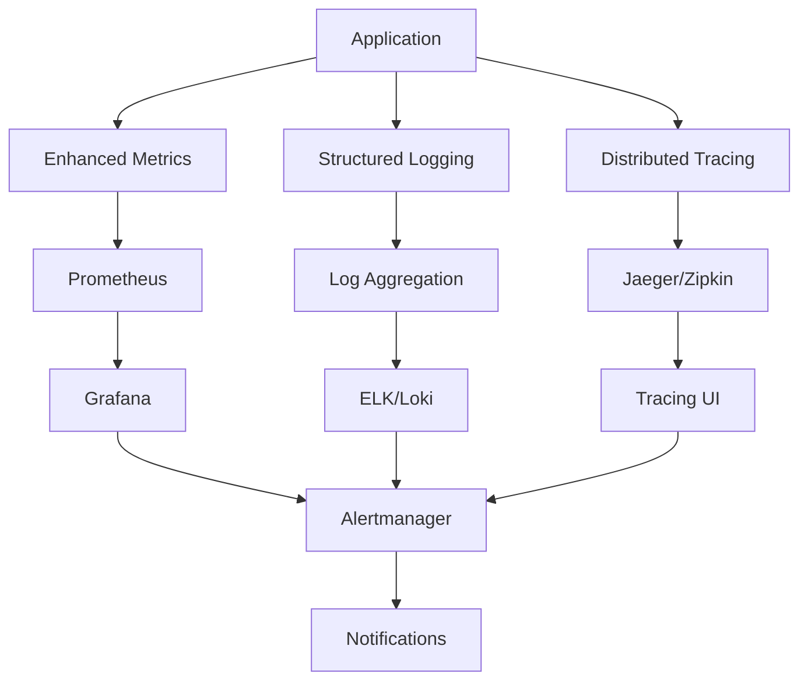

# Monitoring and Observability Guide

## Overview

This document provides a comprehensive guide to the monitoring and observability infrastructure for the OpsSight DevOps Platform. The system implements the three pillars of observability: **Metrics**, **Logs**, and **Traces**, providing complete visibility into system behavior and performance.

## 🎯 Architecture Overview

### Observability Stack



### Components

1. **Metrics Collection**: Prometheus with enhanced custom metrics
2. **Log Management**: Structured JSON logging with correlation IDs
3. **Distributed Tracing**: OpenTelemetry with Jaeger backend
4. **Health Monitoring**: Comprehensive health checks for all components
5. **Alerting**: Multi-channel alerting via AlertManager
6. **Dashboards**: Grafana dashboards for visualization
7. **Log Aggregation**: Centralized log processing and forwarding

## 📊 Metrics System

### Enhanced Metrics Categories

#### 1. System Metrics
```python
# CPU and Load
system_cpu_usage_percent
system_cpu_load_1m, system_cpu_load_5m, system_cpu_load_15m

# Memory
system_memory_usage_bytes{type="used|available|cached|buffers"}
system_memory_usage_percent

# Disk
system_disk_usage_bytes{path="/", type="used|free|total"}
system_disk_usage_percent{path="/"}

# Network
system_network_bytes_total{interface="eth0", direction="rx|tx"}

# Process
system_process_count
system_file_descriptors_open
```

#### 2. Application Metrics
```python
# HTTP Requests
http_requests_total{method, endpoint, status_code, user_type}
http_request_duration_seconds{method, endpoint}
http_request_size_bytes{method, endpoint}
http_response_size_bytes{method, endpoint}

# Database
db_connections_active{database}
db_connections_idle{database}
db_query_duration_seconds{operation, table}
db_slow_queries_total{operation, table}

# Cache
cache_operations_total{operation, cache_type, result}
cache_hit_ratio{cache_type}
cache_memory_usage_bytes{cache_type}

# Background Tasks
background_tasks_active{task_type}
background_task_duration_seconds{task_type}
background_task_errors_total{task_type, error_type}
```

#### 3. Business Metrics
```python
# Users
business_active_users{time_window="1h|1d|1w"}
business_user_sessions_active
business_user_actions_total{action_type, user_role}

# Pipelines
business_pipeline_executions_total{pipeline_type, status, environment}
business_pipeline_duration_seconds{pipeline_type, environment}
business_pipeline_queue_size{priority}

# Deployments
business_deployments_total{environment, status, deployment_type}
business_deployment_frequency_per_day{environment}

# Integrations
business_integration_calls_total{service, operation, status}
business_integration_latency_seconds{service, operation}
```

#### 4. Security Metrics
```python
# Authentication
security_auth_attempts_total{method, result, user_type}
security_failed_logins_total{reason, source_ip_class}

# Rate Limiting
security_rate_limit_violations_total{endpoint, limit_type}
security_blocked_ips_count

# Input Validation
security_input_validation_failures_total{validation_type, endpoint}
security_file_upload_rejections_total{rejection_reason, file_type}
security_events_total{event_type, severity}
```

#### 5. Performance Metrics
```python
# Garbage Collection
performance_gc_collections_total{generation}
performance_gc_duration_seconds{generation}

# Threading
performance_threads_active

# Response Times
performance_response_time_percentiles{endpoint}
performance_resource_utilization_percent{resource_type}
```

### Metrics Collection Implementation

```python
from app.core.enhanced_metrics import get_enhanced_metrics

# Get metrics collector
metrics = get_enhanced_metrics()

# Record HTTP request
metrics.record_http_request(
    method="POST",
    endpoint="/api/users",
    status_code=201,
    duration=0.125,
    request_size=1024,
    response_size=512,
    user_type="authenticated"
)

# Record database query
metrics.record_db_query(
    operation="SELECT",
    table="users",
    duration=0.045
)

# Record security event
metrics.record_security_event(
    event_type="rate_limit_exceeded",
    severity="medium"
)
```

## 📝 Enhanced Logging System

### Structured Logging with Correlation IDs

#### Log Structure
```json
{
  "timestamp": "2024-01-15T10:30:00.123Z",
  "level": "INFO",
  "logger": "api.users",
  "message": "User created successfully",
  "correlation_id": "req-123e4567-e89b-12d3-a456-426614174000",
  "trace_id": "4bf92f3577b34da6a3ce929d0e0e4736",
  "span_id": "00f067aa0ba902b7",
  "category": "api_request",
  "source": {
    "file": "users.py",
    "line": 45,
    "function": "create_user",
    "module": "app.api.v1.endpoints.users"
  },
  "extra": {
    "user_id": "usr_123",
    "endpoint": "/api/v1/users",
    "method": "POST",
    "status_code": 201,
    "duration": 125.5
  }
}
```

#### Enhanced Logging Categories
```python
from app.core.enhanced_logging import LogCategory

# Available categories
LogCategory.AUTHENTICATION      # Auth events
LogCategory.AUTHORIZATION       # Access control
LogCategory.API_REQUEST         # HTTP requests
LogCategory.API_RESPONSE        # HTTP responses
LogCategory.DATABASE_QUERY      # DB operations
LogCategory.DATABASE_CONNECTION # DB connectivity
LogCategory.CACHE_OPERATION     # Cache operations
LogCategory.EXTERNAL_API        # External service calls
LogCategory.PERFORMANCE         # Performance metrics
LogCategory.SECURITY            # Security events
LogCategory.BUSINESS_LOGIC      # Business operations
LogCategory.SYSTEM              # System events
LogCategory.GITHUB_INTEGRATION  # GitHub API calls
LogCategory.WEBSOCKET           # WebSocket events
LogCategory.BACKGROUND_TASK     # Background jobs
LogCategory.FILE_OPERATION      # File operations
LogCategory.NETWORK             # Network events
LogCategory.DEPLOYMENT          # Deployment events
LogCategory.MONITORING          # Monitoring events
LogCategory.AUDIT               # Audit trail
```

#### Usage Examples
```python
from app.core.enhanced_logging import get_logger, correlation_context, log_operation

# Get logger with context
logger = get_logger(__name__)

# Log with correlation context
with correlation_context() as correlation_id:
    logger.info("Processing user request", 
                category=LogCategory.API_REQUEST,
                user_id="usr_123",
                endpoint="/api/users")

# Log operation with automatic timing
@log_operation("create_user", LogCategory.API_REQUEST)
def create_user(user_data):
    # Implementation
    pass

# Log with operation context
with logger.operation_context("process_payment", LogCategory.BUSINESS_LOGIC):
    # Payment processing logic
    pass
```

### Log Aggregation and Forwarding

#### Supported Destinations
- **Elasticsearch**: For search and analysis
- **Grafana Loki**: For log aggregation
- **Datadog**: For cloud-based monitoring
- **Splunk**: For enterprise log management
- **File**: For local log storage

#### Configuration Example
```python
log_aggregation_config = {
    "forwarding": {
        "batch_size": 100,
        "flush_interval": 30,
        "compression": True,
        "destinations": [
            {
                "type": "elasticsearch",
                "url": "http://elasticsearch:9200",
                "index_pattern": "opssight-logs-%Y.%m.%d",
                "api_key": "your-api-key"
            },
            {
                "type": "loki",
                "url": "http://loki:3100",
                "username": "admin",
                "password": "password"
            }
        ]
    }
}
```

## 🔍 Distributed Tracing

### OpenTelemetry Integration

#### Automatic Instrumentation
- **FastAPI**: HTTP requests and responses
- **SQLAlchemy**: Database queries
- **HTTPX/Requests**: External API calls
- **Redis**: Cache operations

#### Configuration
```python
# Environment variables
OTEL_SERVICE_NAME=opssight-backend
OTEL_SERVICE_VERSION=1.0.0
OTEL_TRACING_ENABLED=true
JAEGER_ENDPOINT=http://jaeger:14268/api/traces
OTEL_SAMPLING_RATE=0.1
```

#### Manual Instrumentation
```python
from app.core.telemetry import trace_operation, get_trace_context

# Trace custom operations
@trace_operation("process_pipeline")
async def process_pipeline(pipeline_id):
    with trace_operation("validate_pipeline") as span:
        if span:
            span.set_attribute("pipeline.id", pipeline_id)
        # Validation logic
    
    with trace_operation("execute_pipeline") as span:
        # Execution logic
        pass

# Get trace context
trace_context = get_trace_context()
print(f"Current trace: {trace_context['trace_id']}")
```

## 🏥 Health Check System

### Health Check Endpoints

#### Comprehensive Health Check: `/health`
```json
{
  "status": "healthy",
  "timestamp": "2024-01-15T10:30:00Z",
  "version": "1.0.0",
  "environment": "production",
  "uptime_seconds": 86400,
  "components": [
    {
      "name": "database",
      "status": "healthy",
      "response_time_ms": 45.2,
      "details": {
        "active_connections": 5,
        "idle_connections": 15,
        "pool_size": 20
      },
      "last_checked": "2024-01-15T10:30:00Z"
    },
    {
      "name": "cache",
      "status": "healthy",
      "response_time_ms": 12.1,
      "details": {
        "hit_rate": 0.85,
        "memory_usage_mb": 128
      },
      "last_checked": "2024-01-15T10:30:00Z"
    },
    {
      "name": "github_api",
      "status": "degraded",
      "response_time_ms": 1250.0,
      "details": {
        "rate_limit_remaining": 450,
        "rate_limit_total": 5000
      },
      "last_checked": "2024-01-15T10:30:00Z"
    }
  ],
  "system_metrics": {
    "cpu_percent": 25.4,
    "memory_percent": 68.2,
    "memory_available_mb": 2048,
    "disk_usage_percent": 45.1,
    "disk_free_gb": 12.5,
    "uptime_seconds": 86400,
    "process_count": 142,
    "open_file_descriptors": 85
  },
  "summary": {
    "total_components": 3,
    "healthy_components": 2,
    "degraded_components": 1,
    "unhealthy_components": 0,
    "check_duration_ms": 156.7
  }
}
```

#### Kubernetes Health Checks
- **Liveness**: `/health/liveness` - Service is running
- **Readiness**: `/health/readiness` - Ready to handle requests
- **Startup**: `/health/startup` - Initialization complete

### Health Check Categories
1. **Database**: Connection, query performance, pool status
2. **Cache**: Operations, hit rate, memory usage
3. **External Services**: GitHub API, third-party integrations
4. **System Resources**: CPU, memory, disk, network

## 🚨 Alerting and Notifications

### AlertManager Configuration

#### Alert Routing
```yaml
route:
  group_by: ['alertname', 'cluster', 'service']
  group_wait: 10s
  group_interval: 10s
  repeat_interval: 12h
  receiver: 'default'
  routes:
  - match:
      severity: critical
    receiver: 'pagerduty'
    repeat_interval: 1h
  - match:
      severity: warning
    receiver: 'slack'
    repeat_interval: 12h
  - match:
      team: infrastructure
    receiver: 'email'
    repeat_interval: 4h
```

#### Alert Rules Categories

##### Application Alerts
```yaml
# High error rate
- alert: HighErrorRate
  expr: rate(http_requests_total{status_code=~"5.."}[5m]) > 0.1
  for: 5m
  labels:
    severity: critical
  annotations:
    summary: "High error rate detected"

# High response time
- alert: HighResponseTime
  expr: histogram_quantile(0.95, http_request_duration_seconds) > 2
  for: 10m
  labels:
    severity: warning
```

##### Infrastructure Alerts
```yaml
# High memory usage
- alert: HighMemoryUsage
  expr: system_memory_usage_percent > 85
  for: 5m
  labels:
    severity: warning

# Disk space low
- alert: DiskSpaceLow
  expr: system_disk_usage_percent > 90
  for: 2m
  labels:
    severity: critical
```

##### Business Alerts
```yaml
# Pipeline failure rate
- alert: HighPipelineFailureRate
  expr: rate(business_pipeline_executions_total{status="failed"}[1h]) > 0.2
  for: 10m
  labels:
    severity: warning

# Low deployment frequency
- alert: LowDeploymentFrequency
  expr: business_deployment_frequency_per_day < 0.1
  for: 24h
  labels:
    severity: info
```

### Notification Channels

#### PagerDuty (Critical Alerts)
```yaml
- name: 'pagerduty'
  pagerduty_configs:
  - service_key: 'your-pagerduty-key'
    description: '{{ .GroupLabels.alertname }}: {{ .CommonAnnotations.summary }}'
```

#### Slack (Warning Alerts)
```yaml
- name: 'slack'
  slack_configs:
  - api_url: 'https://hooks.slack.com/services/...'
    channel: '#alerts'
    title: 'OpsSight Alert'
    text: '{{ range .Alerts }}{{ .Annotations.summary }}{{ end }}'
```

#### Email (Infrastructure Alerts)
```yaml
- name: 'email'
  email_configs:
  - to: 'ops-team@company.com'
    subject: '[OpsSight] {{ .GroupLabels.alertname }}'
    body: |
      {{ range .Alerts }}
      Alert: {{ .Annotations.summary }}
      Description: {{ .Annotations.description }}
      {{ end }}
```

## 📈 Dashboard System

### Grafana Dashboard Categories

#### 1. Application Overview Dashboard
- **Request Rate**: QPS by endpoint
- **Response Time**: P50, P95, P99 percentiles
- **Error Rate**: 4xx/5xx errors over time
- **Throughput**: Data transfer rates

#### 2. Infrastructure Dashboard
- **System Resources**: CPU, Memory, Disk, Network
- **Container Metrics**: Pod status, resource usage
- **Database Performance**: Connection pools, query times
- **Cache Performance**: Hit rates, memory usage

#### 3. Business Metrics Dashboard
- **User Activity**: Active users, sessions, actions
- **Pipeline Metrics**: Execution rate, success rate, duration
- **Deployment Metrics**: Frequency, success rate
- **Integration Health**: External service performance

#### 4. Security Dashboard
- **Authentication**: Login attempts, failures
- **Rate Limiting**: Violations, blocked IPs
- **Input Validation**: Failure patterns
- **Security Events**: Threat detection over time

### Dashboard Implementation
```json
{
  "dashboard": {
    "title": "OpsSight Application Overview",
    "panels": [
      {
        "title": "Request Rate",
        "type": "graph",
        "targets": [
          {
            "expr": "rate(http_requests_total[5m])",
            "legendFormat": "{{method}} {{endpoint}}"
          }
        ]
      },
      {
        "title": "Response Time P95",
        "type": "singlestat",
        "targets": [
          {
            "expr": "histogram_quantile(0.95, http_request_duration_seconds)",
            "legendFormat": "P95 Response Time"
          }
        ]
      }
    ]
  }
}
```

## 🛠️ Implementation Guide

### 1. Setup Enhanced Logging
```python
from app.core.enhanced_logging import LoggerFactory

# Initialize logging system
LoggerFactory.initialize(
    log_level="INFO",
    environment="production"
)

# Get logger
logger = LoggerFactory.get_logger(__name__)
```

### 2. Initialize Telemetry
```python
from app.core.telemetry import init_telemetry, TelemetryConfig

# Configure and initialize
config = TelemetryConfig()
config.jaeger_endpoint = "http://jaeger:14268/api/traces"
config.sampling_rate = 0.1

init_telemetry(config)
```

### 3. Setup Enhanced Metrics
```python
from app.core.enhanced_metrics import get_enhanced_metrics

# Get metrics collector
metrics = get_enhanced_metrics()

# Start periodic collection
await metrics.start_periodic_collection(interval=30)
```

### 4. Configure Health Checks
```python
from app.api.v1.endpoints.health import router as health_router

# Add health check routes
app.include_router(health_router, prefix="/api/v1", tags=["health"])
```

### 5. Setup Log Aggregation
```python
from app.core.log_aggregation import get_log_aggregator

# Configure log aggregation
config = {
    "forwarding": {
        "destinations": [
            {
                "type": "elasticsearch",
                "url": "http://elasticsearch:9200"
            }
        ]
    }
}

log_aggregator = get_log_aggregator(config)
```

## 🔧 Configuration

### Environment Variables
```bash
# Tracing
OTEL_SERVICE_NAME=opssight-backend
OTEL_TRACING_ENABLED=true
JAEGER_ENDPOINT=http://jaeger:14268/api/traces

# Logging
LOG_LEVEL=INFO
LOG_FORMAT=json
LOG_AGGREGATION_ENABLED=true

# Metrics
METRICS_ENABLED=true
METRICS_COLLECTION_INTERVAL=30

# Health Checks
HEALTH_CHECK_CACHE_DURATION=30
HEALTH_CHECK_TIMEOUT=10
```

### Docker Compose Integration
```yaml
services:
  backend:
    environment:
      - OTEL_SERVICE_NAME=opssight-backend
      - JAEGER_ENDPOINT=http://jaeger:14268/api/traces
      - ELASTICSEARCH_URL=http://elasticsearch:9200
    
  prometheus:
    ports:
      - "9090:9090"
    
  grafana:
    ports:
      - "3001:3000"
    
  jaeger:
    ports:
      - "16686:16686"
      - "14268:14268"
```

## 📊 Performance Benchmarks

### Monitoring Overhead
- **Metrics Collection**: <2ms per request
- **Structured Logging**: <1ms per log entry
- **Distributed Tracing**: <3ms per trace (10% sampling)
- **Health Checks**: <50ms per check
- **Total Overhead**: <5% of request time

### Resource Usage
- **Memory**: ~50MB additional for monitoring
- **CPU**: <2% additional overhead
- **Disk**: 100MB/day for logs (compressed)
- **Network**: 10KB/min for metrics export

## 🎯 Best Practices

### 1. Metric Naming
- Use descriptive names with units
- Include relevant labels for filtering
- Follow Prometheus naming conventions
- Group related metrics with prefixes

### 2. Log Management
- Use structured logging consistently
- Include correlation IDs in all logs
- Set appropriate log levels
- Implement log rotation and retention

### 3. Tracing Strategy
- Sample traces appropriately (1-10%)
- Add custom attributes to spans
- Trace critical business operations
- Monitor trace collection overhead

### 4. Alert Configuration
- Set meaningful thresholds
- Avoid alert fatigue with proper grouping
- Include actionable information
- Test alert delivery channels

### 5. Dashboard Design
- Focus on key metrics per dashboard
- Use consistent color schemes
- Include context and annotations
- Design for different audiences

## 🚀 Future Enhancements

### Planned Features
1. **Machine Learning Integration**: Anomaly detection for metrics
2. **Advanced Log Analysis**: Pattern recognition and clustering
3. **Predictive Alerting**: Trend-based threshold adjustments
4. **Cost Optimization**: Resource usage optimization suggestions
5. **Compliance Reporting**: Automated compliance metric collection

---

This comprehensive monitoring and observability system provides enterprise-grade visibility into the OpsSight platform, enabling proactive issue detection, performance optimization, and operational excellence.