# OpsSight Platform Architecture

## Overview

OpsSight is a comprehensive DevOps visibility platform designed to provide real-time insights into CI/CD pipelines, infrastructure health, and development workflows. The platform follows a microservices architecture with AI/ML capabilities, multi-cloud support, and mobile accessibility.

## Architecture Diagram

```mermaid
graph TB
    %% User Interfaces
    subgraph "User Interfaces"
        WEB["🌐 Web Dashboard<br/>(Next.js 14+)"]
        MOBILE["📱 Mobile App<br/>(React Native)"]
        CLI["⌨️ CLI Tools"]
    end

    %% API Gateway & Load Balancer
    subgraph "API Gateway"
        LB["🔄 Load Balancer<br/>(NGINX/ALB)"]
        GATEWAY["🚪 API Gateway<br/>(Kong/AWS API Gateway)"]
    end

    %% Backend Services
    subgraph "Backend Services"
        AUTH["🔐 Auth Service<br/>(FastAPI)"]
        CORE["⚙️ Core API<br/>(FastAPI)"]
        METRICS["📊 Metrics Service<br/>(FastAPI)"]
        ALERTS["🚨 Alert Service<br/>(FastAPI)"]
        COST["💰 Cost Service<br/>(FastAPI)"]
        MOBILE_API["📱 Mobile API<br/>(FastAPI)"]
    end

    %% AI/ML Services
    subgraph "AI/ML Layer"
        ML_TRAIN["🧠 ML Training<br/>(Python/TensorFlow)"]
        ML_INFERENCE["🔮 ML Inference<br/>(FastAPI)"]
        COPILOT["🤖 OpsCopilot<br/>(LLM Integration)"]
        ANOMALY["⚠️ Anomaly Detection"]
        FORECAST["📈 Cost Forecasting"]
    end

    %% Data Layer
    subgraph "Data Layer"
        POSTGRES["🐘 PostgreSQL<br/>(Primary DB)"]
        REDIS["🔴 Redis<br/>(Cache/Sessions)"]
        TIMESERIES["📊 InfluxDB<br/>(Time Series)"]
        S3["☁️ Object Storage<br/>(S3/Blob)"]
        KAFKA["🔄 Kafka<br/>(Event Streaming)"]
    end

    %% External Integrations
    subgraph "CI/CD Integrations"
        GITHUB["🐙 GitHub"]
        GITLAB["🦊 GitLab"]
        JENKINS["🏗️ Jenkins"]
        DOCKER["🐳 Docker Registry"]
    end

    subgraph "Cloud Providers"
        AWS["☁️ AWS"]
        AZURE["☁️ Azure"]
        GCP["☁️ Google Cloud"]
    end

    subgraph "Container Orchestration"
        K8S["☸️ Kubernetes"]
        HELM["⚓ Helm Charts"]
    end

    subgraph "Monitoring & Observability"
        PROMETHEUS["📊 Prometheus"]
        GRAFANA["📈 Grafana"]
        JAEGER["🔍 Jaeger"]
        SENTRY["🐛 Sentry"]
    end

    subgraph "Notification Services"
        SLACK["💬 Slack"]
        EMAIL["📧 Email/SMTP"]
        SMS["📱 SMS/Twilio"]
        PAGERDUTY["📟 PagerDuty"]
        PUSH["🔔 Push Notifications<br/>(FCM/APNs)"]
    end

    %% Connections - User Interfaces
    WEB --> LB
    MOBILE --> LB
    CLI --> LB

    %% Connections - API Gateway
    LB --> GATEWAY
    GATEWAY --> AUTH
    GATEWAY --> CORE
    GATEWAY --> METRICS
    GATEWAY --> ALERTS
    GATEWAY --> COST
    GATEWAY --> MOBILE_API

    %% Connections - Backend to Data
    AUTH --> POSTGRES
    AUTH --> REDIS
    CORE --> POSTGRES
    CORE --> REDIS
    METRICS --> TIMESERIES
    METRICS --> REDIS
    ALERTS --> POSTGRES
    ALERTS --> KAFKA
    COST --> POSTGRES
    MOBILE_API --> POSTGRES
    MOBILE_API --> REDIS

    %% Connections - ML Services
    ML_TRAIN --> S3
    ML_TRAIN --> POSTGRES
    ML_INFERENCE --> S3
    ML_INFERENCE --> REDIS
    COPILOT --> ML_INFERENCE
    ANOMALY --> TIMESERIES
    FORECAST --> POSTGRES
    CORE --> ML_INFERENCE
    METRICS --> ANOMALY

    %% Connections - External Integrations
    CORE --> GITHUB
    CORE --> GITLAB
    CORE --> JENKINS
    CORE --> AWS
    CORE --> AZURE
    CORE --> GCP
    CORE --> K8S
    METRICS --> PROMETHEUS
    METRICS --> K8S

    %% Connections - Monitoring
    PROMETHEUS --> GRAFANA
    CORE --> JAEGER
    CORE --> SENTRY

    %% Connections - Notifications
    ALERTS --> SLACK
    ALERTS --> EMAIL
    ALERTS --> SMS
    ALERTS --> PAGERDUTY
    MOBILE_API --> PUSH

    %% Connections - Event Streaming
    KAFKA --> ALERTS
    KAFKA --> ML_TRAIN
    KAFKA --> METRICS

    %% Styling
    classDef userInterface fill:#e1f5fe,stroke:#01579b,stroke-width:2px
    classDef backend fill:#f3e5f5,stroke:#4a148c,stroke-width:2px
    classDef data fill:#e8f5e8,stroke:#1b5e20,stroke-width:2px
    classDef ml fill:#fff3e0,stroke:#e65100,stroke-width:2px
    classDef external fill:#fce4ec,stroke:#880e4f,stroke-width:2px
    classDef monitoring fill:#f1f8e9,stroke:#33691e,stroke-width:2px

    class WEB,MOBILE,CLI userInterface
    class AUTH,CORE,METRICS,ALERTS,COST,MOBILE_API backend
    class POSTGRES,REDIS,TIMESERIES,S3,KAFKA data
    class ML_TRAIN,ML_INFERENCE,COPILOT,ANOMALY,FORECAST ml
    class GITHUB,GITLAB,JENKINS,DOCKER,AWS,AZURE,GCP,K8S,HELM external
    class PROMETHEUS,GRAFANA,JAEGER,SENTRY,SLACK,EMAIL,SMS,PAGERDUTY,PUSH monitoring
```

## Component Details

### User Interfaces

#### Web Dashboard (Next.js 14+)
- **Purpose**: Primary web interface for DevOps teams
- **Features**: Real-time dashboards, pipeline monitoring, cost analytics
- **Technology**: Next.js 14+ with React, TypeScript, and Tailwind CSS
- **Key Capabilities**:
  - Real-time metrics visualization
  - Interactive pipeline monitoring
  - Cost optimization recommendations
  - Team collaboration features

#### Mobile App (React Native)
- **Purpose**: Mobile companion for on-the-go monitoring
- **Features**: Push notifications, offline capabilities, biometric auth
- **Technology**: React Native with Expo, TypeScript
- **Key Capabilities**:
  - Critical alert notifications
  - Quick status checks
  - Emergency response actions
  - Offline data synchronization

#### CLI Tools
- **Purpose**: Command-line interface for automation and scripting
- **Features**: Pipeline management, deployment automation
- **Technology**: Python/Node.js CLI tools
- **Key Capabilities**:
  - CI/CD pipeline control
  - Infrastructure management
  - Automated reporting

### Backend Services

#### Authentication Service
- **Purpose**: Centralized authentication and authorization
- **Technology**: FastAPI with JWT tokens
- **Features**:
  - OAuth integration (GitHub, Google, Azure AD)
  - Role-based access control (RBAC)
  - Multi-factor authentication
  - Session management

#### Core API Service
- **Purpose**: Main business logic and orchestration
- **Technology**: FastAPI with async/await
- **Features**:
  - Pipeline management
  - Infrastructure monitoring
  - Integration orchestration
  - Data aggregation

#### Metrics Service
- **Purpose**: Real-time metrics collection and processing
- **Technology**: FastAPI with time-series optimization
- **Features**:
  - Real-time data ingestion
  - Metrics aggregation
  - Performance monitoring
  - Custom metric definitions

#### Alert Service
- **Purpose**: Intelligent alerting and notification management
- **Technology**: FastAPI with event-driven architecture
- **Features**:
  - Smart alert routing
  - Escalation policies
  - Alert correlation
  - Notification delivery

#### Cost Service
- **Purpose**: Multi-cloud cost management and optimization
- **Technology**: FastAPI with cloud provider APIs
- **Features**:
  - Cost tracking across clouds
  - Optimization recommendations
  - Budget alerts
  - Resource rightsizing

#### Mobile API Service
- **Purpose**: Specialized API for mobile app requirements
- **Technology**: FastAPI optimized for mobile
- **Features**:
  - Push notification management
  - Offline data synchronization
  - Mobile-optimized responses
  - Bandwidth optimization

### AI/ML Layer

#### ML Training Pipeline
- **Purpose**: Model training and retraining automation
- **Technology**: Python with TensorFlow/PyTorch, MLflow
- **Features**:
  - Automated model training
  - Hyperparameter optimization
  - Model versioning
  - Performance tracking

#### ML Inference Service
- **Purpose**: Real-time model predictions
- **Technology**: FastAPI with model serving
- **Features**:
  - Low-latency predictions
  - Model A/B testing
  - Batch inference
  - Model monitoring

#### OpsCopilot
- **Purpose**: AI-powered DevOps assistant
- **Technology**: LLM integration with custom training
- **Features**:
  - Natural language queries
  - Automated troubleshooting
  - Best practice recommendations
  - Context-aware assistance

#### Anomaly Detection
- **Purpose**: Automated anomaly detection in metrics
- **Technology**: Machine learning algorithms
- **Features**:
  - Real-time anomaly detection
  - Pattern recognition
  - Baseline learning
  - False positive reduction

#### Cost Forecasting
- **Purpose**: Predictive cost analytics
- **Technology**: Time series forecasting models
- **Features**:
  - Cost trend prediction
  - Budget planning assistance
  - Resource optimization
  - Scenario modeling

### Data Layer

#### PostgreSQL
- **Purpose**: Primary relational database
- **Use Cases**: User data, configurations, relationships
- **Features**:
  - ACID compliance
  - Complex queries
  - Data integrity
  - Backup and recovery

#### Redis
- **Purpose**: In-memory cache and session store
- **Use Cases**: Caching, sessions, real-time data
- **Features**:
  - High-performance caching
  - Session management
  - Pub/Sub messaging
  - Data structures

#### InfluxDB (Time Series)
- **Purpose**: Time-series data storage
- **Use Cases**: Metrics, logs, performance data
- **Features**:
  - Optimized for time-series
  - High write throughput
  - Data retention policies
  - Downsampling

#### Object Storage (S3/Blob)
- **Purpose**: File and artifact storage
- **Use Cases**: ML models, logs, backups
- **Features**:
  - Scalable storage
  - Versioning
  - Lifecycle management
  - Cross-region replication

#### Kafka
- **Purpose**: Event streaming and message queue
- **Use Cases**: Real-time data pipelines, event sourcing
- **Features**:
  - High throughput
  - Fault tolerance
  - Stream processing
  - Event replay

### External Integrations

#### CI/CD Platforms
- **GitHub**: Repository management, Actions integration
- **GitLab**: CI/CD pipelines, merge request automation
- **Jenkins**: Build automation, deployment pipelines
- **Docker Registry**: Container image management

#### Cloud Providers
- **AWS**: EC2, EKS, RDS, S3, CloudWatch
- **Azure**: AKS, Azure Monitor, Blob Storage
- **Google Cloud**: GKE, Cloud Monitoring, Cloud Storage

#### Container Orchestration
- **Kubernetes**: Container orchestration and management
- **Helm**: Package management for Kubernetes

#### Monitoring & Observability
- **Prometheus**: Metrics collection and alerting
- **Grafana**: Visualization and dashboards
- **Jaeger**: Distributed tracing
- **Sentry**: Error tracking and performance monitoring

#### Notification Services
- **Slack**: Team communication and alerts
- **Email/SMTP**: Email notifications
- **SMS/Twilio**: SMS alerts for critical issues
- **PagerDuty**: Incident management and escalation
- **Push Notifications**: Mobile app notifications (FCM/APNs)

## Data Flow Patterns

### Real-time Metrics Pipeline
1. **Collection**: Metrics collected from various sources (K8s, cloud providers, applications)
2. **Ingestion**: Data ingested through Kafka for real-time processing
3. **Processing**: Metrics service processes and aggregates data
4. **Storage**: Time-series data stored in InfluxDB
5. **Analysis**: ML models analyze for anomalies and patterns
6. **Visualization**: Real-time dashboards display processed metrics

### Alert Workflow
1. **Detection**: Anomaly detection or threshold breach
2. **Correlation**: Alert service correlates related events
3. **Routing**: Smart routing based on severity and team
4. **Notification**: Multi-channel notification delivery
5. **Escalation**: Automatic escalation if not acknowledged
6. **Resolution**: Tracking and post-incident analysis

### ML Training Pipeline
1. **Data Collection**: Historical data from various sources
2. **Feature Engineering**: Data preprocessing and feature extraction
3. **Model Training**: Automated training with hyperparameter optimization
4. **Validation**: Model validation and performance testing
5. **Deployment**: Model deployment to inference service
6. **Monitoring**: Continuous monitoring of model performance

## Security Considerations

### Authentication & Authorization
- OAuth 2.0 with PKCE for secure authentication
- JWT tokens with short expiration times
- Role-based access control (RBAC)
- Multi-factor authentication (MFA)

### Data Protection
- Encryption at rest and in transit
- Secrets management with HashiCorp Vault
- Regular security audits and penetration testing
- Compliance with SOC 2, GDPR, and industry standards

### Network Security
- VPC isolation and network segmentation
- API rate limiting and DDoS protection
- Web Application Firewall (WAF)
- Regular vulnerability scanning

## Scalability & Performance

### Horizontal Scaling
- Microservices architecture for independent scaling
- Container orchestration with Kubernetes
- Auto-scaling based on metrics and load
- Load balancing across multiple instances

### Performance Optimization
- Caching strategies with Redis
- Database query optimization
- CDN for static assets
- Asynchronous processing for heavy operations

### High Availability
- Multi-region deployment
- Database replication and failover
- Circuit breakers for fault tolerance
- Health checks and automatic recovery

## Deployment Strategy

### Infrastructure as Code
- Terraform for cloud resource provisioning
- Helm charts for Kubernetes deployments
- GitOps workflow with ArgoCD
- Environment-specific configurations

### CI/CD Pipeline
- Automated testing (unit, integration, e2e)
- Security scanning and vulnerability assessment
- Blue-green deployments for zero downtime
- Rollback capabilities and canary releases

### Monitoring & Observability
- Comprehensive logging with structured logs
- Distributed tracing for request flow
- Custom metrics and SLI/SLO monitoring
- Alerting on key performance indicators

This architecture provides a robust, scalable, and maintainable foundation for the OpsSight platform, enabling comprehensive DevOps visibility and automation across multi-cloud environments. 