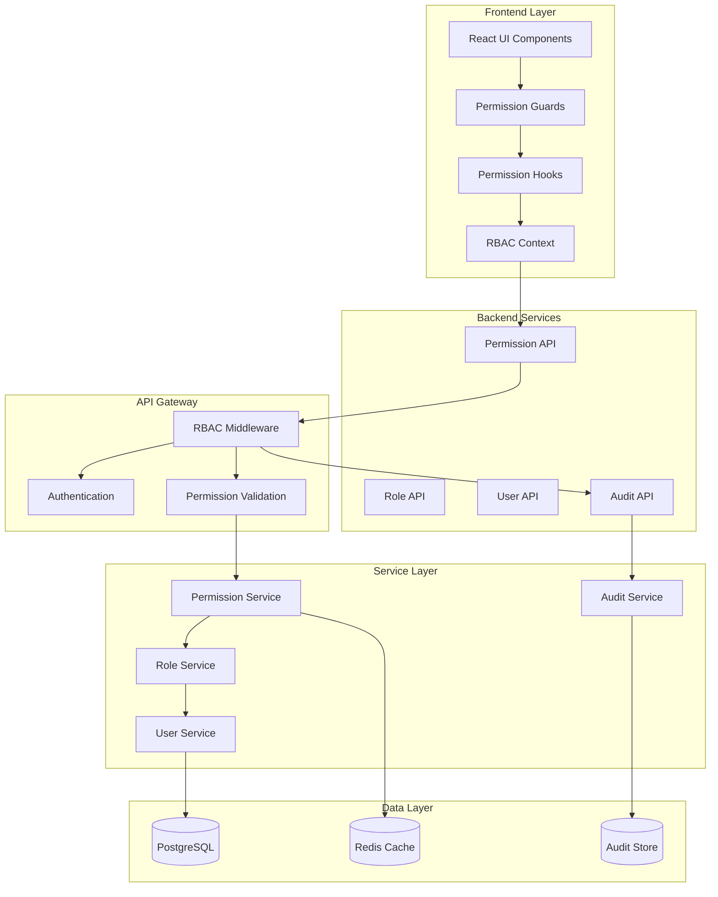
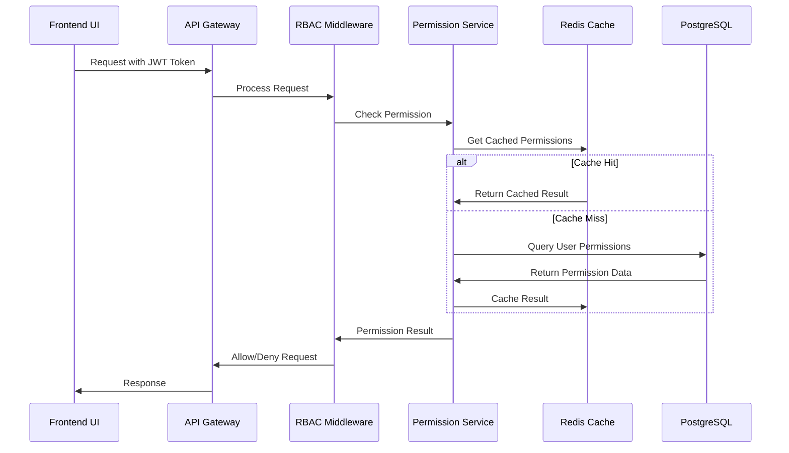
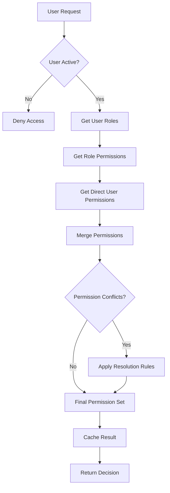

# RBAC System Architecture Documentation

## Overview

This document provides a comprehensive architectural overview of the Role-Based Access Control (RBAC) system implemented in the OpsSight DevOps platform. The system is designed to provide secure, scalable, and maintainable access control across the entire application stack.

## Table of Contents

1. [System Architecture](#system-architecture)
2. [Component Architecture](#component-architecture)
3. [Data Flow](#data-flow)
4. [Permission Resolution](#permission-resolution)
5. [Database Schema](#database-schema)
6. [API Architecture](#api-architecture)
7. [Frontend Architecture](#frontend-architecture)
8. [Security Model](#security-model)
9. [Performance Considerations](#performance-considerations)
10. [Scalability Design](#scalability-design)
11. [Integration Points](#integration-points)
12. [Monitoring and Auditing](#monitoring-and-auditing)

## System Architecture

### High-Level Architecture



### Core Principles

1. **Separation of Concerns**: Clear separation between authentication, authorization, and business logic
2. **Single Source of Truth**: Centralized permission management with consistent enforcement
3. **Least Privilege**: Users receive minimum necessary permissions
4. **Defense in Depth**: Multiple layers of security checks
5. **Auditability**: All permission operations are logged and traceable

## Component Architecture

### Backend Components

#### 1. Permission Service Layer
```python
# Core service responsible for permission management
class PermissionService:
    - assign_user_permission()
    - revoke_user_permission()
    - list_user_permissions()
    - has_permission()
    - bulk_permission_operations()
```

#### 2. Role Service Layer
```python
# Manages role definitions and assignments
class RoleService:
    - create_role()
    - assign_role_to_user()
    - get_role_permissions()
    - update_role_permissions()
    - get_user_roles()
```

#### 3. RBAC Context
```python
# Runtime context for permission checking
class RBACContext:
    - user: User
    - organization: Organization
    - session: DatabaseSession
    - cached_permissions: Dict[str, bool]
```

#### 4. Permission Middleware
```python
# FastAPI middleware for automatic permission checking
class RBACMiddleware:
    - extract_user_context()
    - validate_permissions()
    - log_access_attempts()
    - handle_permission_errors()
```

### Frontend Components

#### 1. Permission Context
```typescript
// React context for permission state management
interface PermissionContextType {
    userPermissions: UserPermissions | null;
    hasPermission: (permission: PermissionType) => boolean;
    refreshPermissions: () => Promise<void>;
}
```

#### 2. Permission Guards
```typescript
// Components for conditional rendering based on permissions
<PermissionGuard permission={PermissionType.VIEW_USERS}>
    <UserList />
</PermissionGuard>
```

#### 3. Protected Routes
```typescript
// Route-level permission checking
<ProtectedRoute requiredPermissions={[PermissionType.MANAGE_USERS]}>
    <AdminPanel />
</ProtectedRoute>
```

## Data Flow

### Permission Check Flow



### User Permission Resolution



## Permission Resolution

### Resolution Algorithm

The system uses a priority-based permission resolution algorithm:

1. **User-Level Permissions** (Highest Priority)
   - Direct permissions assigned to user
   - Can override role permissions
   - Explicit grants and denials

2. **Role-Level Permissions** (Medium Priority)
   - Permissions inherited from assigned roles
   - Hierarchical role inheritance
   - Multiple role aggregation

3. **Default Permissions** (Lowest Priority)
   - System-wide default permissions
   - Fallback when no explicit permissions exist

### Resolution Rules

```python
def resolve_permission(user: User, permission: PermissionType, organization: Organization) -> bool:
    """
    Permission resolution algorithm
    """
    # 1. Check user-specific permissions first
    user_permission = get_user_permission(user.id, permission, organization.id)
    if user_permission is not None:
        return user_permission.is_active
    
    # 2. Check role-based permissions
    user_roles = get_user_roles(user.id, organization.id)
    for role in sorted(user_roles, key=lambda r: r.priority, reverse=True):
        if permission in role.permissions:
            return True
    
    # 3. Default deny
    return False
```

## Database Schema

### Core Tables

#### Users Table
```sql
CREATE TABLE users (
    id SERIAL PRIMARY KEY,
    organization_id INTEGER REFERENCES organizations(id),
    github_id VARCHAR(255) UNIQUE,
    email VARCHAR(255) UNIQUE,
    is_active BOOLEAN DEFAULT TRUE,
    created_at TIMESTAMP DEFAULT NOW(),
    updated_at TIMESTAMP DEFAULT NOW()
);
```

#### Roles Table
```sql
CREATE TABLE roles (
    id SERIAL PRIMARY KEY,
    name VARCHAR(100) UNIQUE NOT NULL,
    display_name VARCHAR(100) NOT NULL,
    description TEXT,
    priority INTEGER DEFAULT 0,
    is_system_role BOOLEAN DEFAULT FALSE,
    created_at TIMESTAMP DEFAULT NOW()
);
```

#### Permissions Table
```sql
CREATE TABLE permissions (
    id SERIAL PRIMARY KEY,
    name VARCHAR(100) UNIQUE NOT NULL,
    display_name VARCHAR(100) NOT NULL,
    description TEXT,
    category VARCHAR(50) NOT NULL,
    created_at TIMESTAMP DEFAULT NOW()
);
```

#### User Roles Table
```sql
CREATE TABLE user_roles (
    id SERIAL PRIMARY KEY,
    user_id INTEGER REFERENCES users(id),
    role_id INTEGER REFERENCES roles(id),
    organization_id INTEGER REFERENCES organizations(id),
    is_active BOOLEAN DEFAULT TRUE,
    assigned_at TIMESTAMP DEFAULT NOW(),
    assigned_by INTEGER REFERENCES users(id),
    UNIQUE(user_id, role_id, organization_id)
);
```

#### User Permissions Table
```sql
CREATE TABLE user_permissions (
    id SERIAL PRIMARY KEY,
    user_id INTEGER REFERENCES users(id),
    permission_id INTEGER REFERENCES permissions(id),
    organization_id INTEGER REFERENCES organizations(id),
    is_active BOOLEAN DEFAULT TRUE,
    granted_at TIMESTAMP DEFAULT NOW(),
    granted_by INTEGER REFERENCES users(id),
    UNIQUE(user_id, permission_id, organization_id)
);
```

#### Role Permissions Table
```sql
CREATE TABLE role_permissions (
    role_id INTEGER REFERENCES roles(id),
    permission_id INTEGER REFERENCES permissions(id),
    PRIMARY KEY (role_id, permission_id)
);
```

### Indexes and Constraints

```sql
-- Performance indexes
CREATE INDEX idx_user_roles_user_org ON user_roles(user_id, organization_id);
CREATE INDEX idx_user_permissions_user_org ON user_permissions(user_id, organization_id);
CREATE INDEX idx_user_permissions_active ON user_permissions(is_active) WHERE is_active = TRUE;

-- Partial indexes for active records
CREATE INDEX idx_user_roles_active ON user_roles(user_id, role_id) WHERE is_active = TRUE;
```

## API Architecture

### RESTful API Design

#### Permission Endpoints
```
POST   /api/v1/permissions/users/{user_id}/permissions/assign
POST   /api/v1/permissions/users/{user_id}/permissions/revoke
GET    /api/v1/permissions/users/{user_id}/permissions
GET    /api/v1/permissions/validate/{user_id}/{permission}
POST   /api/v1/permissions/validate/bulk
```

#### Role Endpoints
```
GET    /api/v1/roles
POST   /api/v1/roles
GET    /api/v1/roles/{role_id}
PUT    /api/v1/roles/{role_id}
DELETE /api/v1/roles/{role_id}
GET    /api/v1/roles/{role_id}/permissions
PUT    /api/v1/roles/{role_id}/permissions
```

#### User Role Endpoints
```
POST   /api/v1/users/{user_id}/roles/assign
POST   /api/v1/users/{user_id}/roles/revoke
GET    /api/v1/users/{user_id}/roles
```

### API Security

#### Authentication
- JWT-based authentication
- Token validation middleware
- Refresh token mechanism

#### Authorization
- Permission-based endpoint protection
- Organization context validation
- Rate limiting per user/organization

#### Input Validation
- Pydantic schema validation
- SQL injection prevention
- XSS protection

## Frontend Architecture

### React Context Architecture

```typescript
// Context hierarchy
<AuthProvider>
  <OrganizationProvider>
    <PermissionProvider>
      <App />
    </PermissionProvider>
  </OrganizationProvider>
</AuthProvider>
```

### State Management

#### Permission State
```typescript
interface PermissionState {
  userPermissions: UserPermissions | null;
  loading: boolean;
  error: string | null;
  lastUpdated: Date | null;
}
```

#### Cache Management
- Client-side permission caching
- Automatic cache invalidation
- Optimistic updates

### Component Architecture

#### Higher-Order Components
```typescript
// Permission-aware HOCs
withPermission(Component, requiredPermissions)
withRole(Component, requiredRoles)
```

#### Render Props Pattern
```typescript
<PermissionCheck permission={PermissionType.VIEW_USERS}>
  {({ hasPermission, loading }) => (
    hasPermission ? <UserList /> : <AccessDenied />
  )}
</PermissionCheck>
```

## Security Model

### Multi-Layer Security

#### Layer 1: Frontend Guards
- Component-level permission checks
- Route-level protection
- Form field disabling

#### Layer 2: API Gateway
- JWT token validation
- Rate limiting
- Request sanitization

#### Layer 3: Business Logic
- Service-level permission checks
- Data access validation
- Audit logging

#### Layer 4: Database
- Row-level security
- Organization isolation
- Query parameter validation

### Threat Mitigation

#### Common Attacks
1. **Privilege Escalation**
   - Mitigation: Strict role hierarchy validation
   - Multiple validation layers

2. **Cross-Organization Access**
   - Mitigation: Organization context validation
   - Database-level isolation

3. **Permission Bypass**
   - Mitigation: Comprehensive middleware coverage
   - Audit logging

4. **Token Hijacking**
   - Mitigation: JWT expiration
   - Secure token storage

## Performance Considerations

### Caching Strategy

#### Multi-Level Caching
```python
# Cache hierarchy
L1_Cache = "In-Memory (Application)"
L2_Cache = "Redis (Distributed)"
L3_Cache = "Database Query Cache"
```

#### Cache Invalidation
```python
def invalidate_user_permissions(user_id: int, organization_id: int):
    """Invalidate permission cache for user"""
    cache_key = f"permissions:{user_id}:{organization_id}"
    redis.delete(cache_key)
    
    # Invalidate related caches
    role_cache_key = f"roles:{user_id}:{organization_id}"
    redis.delete(role_cache_key)
```

### Database Optimization

#### Query Optimization
```sql
-- Optimized permission check query
SELECT p.name 
FROM permissions p
JOIN role_permissions rp ON p.id = rp.permission_id
JOIN roles r ON rp.role_id = r.id
JOIN user_roles ur ON r.id = ur.role_id
WHERE ur.user_id = ? 
  AND ur.organization_id = ?
  AND ur.is_active = TRUE
UNION
SELECT p.name 
FROM permissions p
JOIN user_permissions up ON p.id = up.permission_id
WHERE up.user_id = ? 
  AND up.organization_id = ?
  AND up.is_active = TRUE;
```

#### Connection Pooling
```python
# Database connection pool configuration
DATABASE_POOL_CONFIG = {
    "pool_size": 20,
    "max_overflow": 30,
    "pool_timeout": 30,
    "pool_recycle": 3600,
}
```

## Scalability Design

### Horizontal Scaling

#### Stateless Services
- Stateless permission services
- Shared cache for session state
- Database connection pooling

#### Load Balancing
- API gateway load balancing
- Session affinity for cached data
- Health check endpoints

### Vertical Scaling

#### Resource Optimization
- Efficient database queries
- Memory-efficient caching
- CPU-optimized algorithms

#### Monitoring
- Performance metrics collection
- Resource usage tracking
- Bottleneck identification

## Integration Points

### External Systems

#### Identity Providers
```python
# SSO integration
class SSOProvider:
    def authenticate(self, token: str) -> User:
        # Validate with external IdP
        # Map to internal user model
        # Sync role assignments
```

#### Audit Systems
```python
# Audit event publishing
class AuditPublisher:
    def publish_permission_event(self, event: PermissionEvent):
        # Send to external audit system
        # Log to internal audit store
```

### Internal Systems

#### API Gateway Integration
```python
# Middleware integration
@app.middleware("http")
async def rbac_middleware(request: Request, call_next):
    # Extract user context
    # Validate permissions
    # Log access attempts
```

#### Database Integration
```python
# Database session management
class DatabaseSession:
    def __init__(self, user_context: RBACContext):
        self.user_context = user_context
        self.session = get_db_session()
```

## Monitoring and Auditing

### Metrics Collection

#### Permission Metrics
- Permission check latency
- Cache hit/miss ratios
- Permission denial rates
- User activity patterns

#### System Metrics
- API response times
- Database query performance
- Cache utilization
- Error rates

### Audit Logging

#### Event Types
```python
class AuditEventType(Enum):
    PERMISSION_ASSIGNED = "permission_assigned"
    PERMISSION_REVOKED = "permission_revoked"
    ROLE_ASSIGNED = "role_assigned"
    ROLE_REVOKED = "role_revoked"
    ACCESS_GRANTED = "access_granted"
    ACCESS_DENIED = "access_denied"
```

#### Audit Schema
```python
class AuditEvent:
    id: str
    event_type: AuditEventType
    user_id: int
    organization_id: int
    resource: str
    action: str
    outcome: str
    timestamp: datetime
    metadata: Dict[str, Any]
```

### Alerting

#### Security Alerts
- Multiple permission failures
- Unusual access patterns
- Privilege escalation attempts
- System errors

#### Performance Alerts
- High permission check latency
- Cache performance degradation
- Database query slowdowns
- Resource exhaustion

## Conclusion

The RBAC system architecture provides a comprehensive, secure, and scalable solution for access control in the OpsSight platform. The multi-layered approach ensures security while maintaining performance and usability. The system is designed to handle enterprise-scale deployments while providing flexibility for future enhancements.

Key architectural strengths:
- **Security**: Multi-layer defense with comprehensive audit logging
- **Performance**: Efficient caching and optimized database queries
- **Scalability**: Horizontal and vertical scaling capabilities
- **Maintainability**: Clean separation of concerns and well-defined interfaces
- **Flexibility**: Extensible design for future requirements

For implementation details, refer to the specific component documentation in the backend and frontend developer guides.