# OpsSight Testing and Validation Guide

This document provides comprehensive guidance for testing and validating the OpsSight deployment pipeline and application infrastructure.

## Table of Contents

1. [Overview](#overview)
2. [Test Architecture](#test-architecture)
3. [Test Categories](#test-categories)
4. [Test Scripts](#test-scripts)
5. [Running Tests](#running-tests)
6. [Test Configuration](#test-configuration)
7. [Troubleshooting](#troubleshooting)
8. [Best Practices](#best-practices)

## Overview

The OpsSight testing framework provides comprehensive validation of:

- ✅ **Infrastructure**: Terraform modules, AWS resources, EKS cluster
- ✅ **Kubernetes Platform**: Deployments, services, networking, storage
- ✅ **CI/CD Pipeline**: GitHub Actions workflows, container building, deployment
- ✅ **Monitoring Stack**: Prometheus, Grafana, AlertManager, logging
- ✅ **Secrets Management**: AWS Secrets Manager, CSI driver, RBAC
- ✅ **Application**: API endpoints, frontend, user workflows
- ✅ **Security**: RBAC, network policies, container security
- ✅ **Performance**: Load testing, resource utilization

## Test Architecture

```mermaid
graph TB
    A[Test Orchestrator] --> B[Infrastructure Tests]
    A --> C[Secrets Management Tests]
    A --> D[Application Integration Tests]
    A --> E[Load Tests]
    A --> F[Security Tests]
    
    B --> B1[Terraform Validation]
    B --> B2[AWS Resources]
    B --> B3[EKS Cluster]
    B --> B4[Networking]
    
    C --> C1[Secrets Manager]
    C --> C2[CSI Driver]
    C --> C3[IRSA/OIDC]
    C --> C4[Secret Access]
    
    D --> D1[API Health]
    D --> D2[Authentication]
    D --> D3[Business Logic]
    D --> D4[Frontend]
    
    E --> E1[Concurrent Users]
    E --> E2[Response Times]
    E --> E3[Resource Usage]
    E --> E4[Error Rates]
    
    F --> F1[RBAC]
    F --> F2[Container Security]
    F --> F3[Network Policies]
    F --> F4[Vulnerabilities]
```



## Test Categories

### 1. Infrastructure Validation

**Purpose**: Validate that all infrastructure components are properly deployed and configured.

**Components Tested**:
- Terraform state and configuration
- VPC, subnets, security groups
- EKS cluster and node groups
- Load balancer controllers
- IAM roles and policies

**Key Validations**:
- Infrastructure drift detection
- Resource accessibility and health
- Network connectivity
- Security group rules
- OIDC provider configuration

### 2. Secrets Management Validation

**Purpose**: Ensure secure storage and retrieval of application secrets.

**Components Tested**:
- AWS Secrets Manager resources
- Kubernetes Secrets Store CSI Driver
- Service account IRSA annotations
- SecretProviderClass configurations
- End-to-end secret mounting

**Key Validations**:
- Secret creation and rotation
- CSI driver functionality
- RBAC permissions
- Secret synchronization
- Audit trail verification

### 3. Application Integration Testing

**Purpose**: Validate application functionality and API endpoints.

**Components Tested**:
- Frontend React application
- Backend FastAPI services
- Authentication system
- Database connectivity
- API endpoints

**Key Validations**:
- Health and readiness checks
- User registration and login
- CRUD operations
- WebSocket connections
- Error handling

### 4. Load Testing

**Purpose**: Assess system performance under various load conditions.

**Test Scenarios**:
- Concurrent user simulation
- API endpoint stress testing
- Resource utilization monitoring
- Response time measurement
- Error rate analysis

**Metrics Collected**:
- Requests per second
- Average/min/max response times
- 95th and 99th percentile response times
- Success/failure rates
- Resource consumption

### 5. Security Validation

**Purpose**: Ensure security best practices are implemented.

**Security Checks**:
- RBAC configuration
- Container security contexts
- Network policy enforcement
- Privileged container detection
- Secret exposure prevention

## Test Scripts

### Master Orchestrator

**Script**: `scripts/run-all-tests.sh`
**Purpose**: Orchestrates the complete test suite execution

```bash
# Run complete test suite with defaults
./scripts/run-all-tests.sh

# Test production environment
./scripts/run-all-tests.sh --environment production

# Skip load tests with verbose output
./scripts/run-all-tests.sh --skip-load-tests --verbose

# Fail-fast mode with custom load testing
./scripts/run-all-tests.sh --fail-fast --concurrent-users 20 --load-test-duration 120
```

### Infrastructure Validation

**Script**: `scripts/validate-deployment-pipeline.sh`
**Purpose**: Comprehensive infrastructure and platform validation

```bash
# Validate staging environment
./scripts/validate-deployment-pipeline.sh --environment staging

# Validate with custom cluster and region
./scripts/validate-deployment-pipeline.sh \
  --cluster-name my-cluster \
  --region us-east-1 \
  --verbose
```

### Secrets Management

**Script**: `scripts/validate-secrets-management.sh`
**Purpose**: Dedicated secrets management validation

```bash
# Validate secrets management
./scripts/validate-secrets-management.sh --environment staging

# Auto-fix issues during validation
./scripts/validate-secrets-management.sh --fix --environment production
```

### Application Integration

**Script**: `scripts/integration-test.sh`
**Purpose**: End-to-end application functionality testing

```bash
# Test application in staging namespace
./scripts/integration-test.sh --namespace opsight-staging

# Test with custom timeout
./scripts/integration-test.sh --timeout 600
```

### Load Testing

**Script**: `scripts/load-test.sh`
**Purpose**: Performance and load testing

```bash
# Basic load test
./scripts/load-test.sh --namespace opsight-staging

# Extended load test with more users
./scripts/load-test.sh \
  --concurrent-users 50 \
  --duration 300 \
  --ramp-up 30
```

## Running Tests

### Prerequisites

1. **Required Tools**:
   ```bash
   # Install required tools
   aws --version
   kubectl version --client
   helm version
   terraform version
   curl --version
   jq --version
   ```

2. **AWS Configuration**:
   ```bash
   # Configure AWS credentials
   aws configure
   
   # Verify access
   aws sts get-caller-identity
   ```

3. **Kubernetes Access**:
   ```bash
   # Update kubeconfig
   aws eks update-kubeconfig --region us-west-2 --name opsight-eks-cluster
   
   # Verify connectivity
   kubectl cluster-info
   ```

### Quick Start

1. **Run Complete Test Suite**:
   ```bash
   # Navigate to project root
   cd /path/to/opsight-project
   
   # Run all tests
   ./scripts/run-all-tests.sh
   ```

2. **Run Individual Test Categories**:
   ```bash
   # Infrastructure only
   ./scripts/validate-deployment-pipeline.sh
   
   # Application integration only
   ./scripts/integration-test.sh
   
   # Load testing only
   ./scripts/load-test.sh
   ```

3. **Review Results**:
   ```bash
   # View generated reports
   ls -la *-report-*.html
   
   # Open report in browser
   open test-suite-report-20240101-120000.html
   ```

### Environment-Specific Testing

#### Staging Environment
```bash
./scripts/run-all-tests.sh \
  --environment staging \
  --namespace opsight-staging \
  --concurrent-users 10 \
  --load-test-duration 60
```

#### Production Environment
```bash
./scripts/run-all-tests.sh \
  --environment production \
  --namespace opsight-production \
  --skip-load-tests \
  --skip-destructive
```

#### Development Environment
```bash
./scripts/run-all-tests.sh \
  --environment development \
  --namespace opsight-dev \
  --concurrent-users 5 \
  --load-test-duration 30
```

## Test Configuration

### Environment Variables

```bash
# AWS Configuration
export AWS_REGION=us-west-2
export AWS_PROFILE=opsight

# Kubernetes Configuration
export KUBECONFIG=~/.kube/config
export CLUSTER_NAME=opsight-eks-cluster

# Test Configuration
export ENVIRONMENT=staging
export NAMESPACE=opsight-staging
export CONCURRENT_USERS=10
export LOAD_TEST_DURATION=60
export SKIP_LOAD_TESTS=false
export SKIP_DESTRUCTIVE=true
export VERBOSE=false
export FAIL_FAST=false
```

### Script Parameters

All test scripts support standardized parameters:

| Parameter | Description | Default | Example |
|-----------|-------------|---------|---------|
| `--environment` | Target environment | `staging` | `production` |
| `--cluster-name` | EKS cluster name | `opsight-eks-cluster` | `my-cluster` |
| `--region` | AWS region | `us-west-2` | `us-east-1` |
| `--namespace` | Kubernetes namespace | `opsight-staging` | `opsight-prod` |
| `--timeout` | Operation timeout (seconds) | `300` | `600` |
| `--verbose` | Enable verbose output | `false` | `true` |
| `--help` | Show help message | - | - |

### Load Test Configuration

| Parameter | Description | Default | Range |
|-----------|-------------|---------|-------|
| `--concurrent-users` | Simultaneous users | `10` | `1-100` |
| `--duration` | Test duration (seconds) | `60` | `30-3600` |
| `--ramp-up` | Ramp-up time (seconds) | `10` | `5-300` |

## Test Reports

### HTML Reports

Each test script generates comprehensive HTML reports:

- **Infrastructure Report**: `validation-report-YYYYMMDD-HHMMSS.html`
- **Integration Report**: `integration-test-report-YYYYMMDD-HHMMSS.html`
- **Load Test Report**: `load-test-report-YYYYMMDD-HHMMSS.html`
- **Complete Suite Report**: `test-suite-report-YYYYMMDD-HHMMSS.html`

### JSON Results

Machine-readable results are available in JSON format:

```json
{
  "test_suite_results": [
    {
      "name": "Infrastructure Validation",
      "status": "PASSED",
      "details": "All validations completed successfully",
      "duration": 120,
      "timestamp": "2024-01-01T12:00:00Z"
    }
  ],
  "summary": {
    "total": 5,
    "passed": 4,
    "failed": 1
  }
}
```

### Log Files

Detailed execution logs are saved in `/tmp/opsight-*-*/` directories during test execution.

## Troubleshooting

### Common Issues

#### 1. AWS Credentials Not Configured
```bash
Error: AWS credentials not configured

Solution:
aws configure
# or
export AWS_PROFILE=opsight
```

#### 2. Kubernetes Cluster Not Accessible
```bash
Error: Kubernetes API not accessible

Solution:
aws eks update-kubeconfig --region us-west-2 --name opsight-eks-cluster
kubectl cluster-info
```

#### 3. Port Forward Failures
```bash
Error: Port forward failed

Solution:
# Kill existing port forwards
pkill -f "kubectl port-forward"

# Check pod status
kubectl get pods -n opsight-staging

# Restart port forwards
kubectl port-forward -n opsight-staging service/opsight-frontend 8080:80
```

#### 4. Load Test Timeouts
```bash
Error: Load test timeout

Solution:
# Increase timeout
./scripts/load-test.sh --duration 120

# Reduce concurrent users
./scripts/load-test.sh --concurrent-users 5

# Check resource limits
kubectl top nodes
kubectl top pods -n opsight-staging
```

#### 5. Test Environment Not Ready
```bash
Error: Deployments not ready

Solution:
# Check deployment status
kubectl get deployments -n opsight-staging

# Check pod logs
kubectl logs -n opsight-staging deployment/opsight-backend

# Scale up if needed
kubectl scale deployment opsight-backend --replicas=2 -n opsight-staging
```

### Debug Mode

Enable verbose logging for troubleshooting:

```bash
# Enable debug mode
./scripts/run-all-tests.sh --verbose

# Check specific logs
tail -f /tmp/opsight-test-suite-*/test-suite.log
```

### Manual Validation

For manual testing and validation:

```bash
# Check infrastructure
terraform plan -detailed-exitcode

# Check Kubernetes
kubectl get all -n opsight-staging

# Test API manually
curl http://localhost:8000/health

# Check secrets
kubectl get secrets -n opsight-staging
kubectl describe secretproviderclass -n opsight-staging
```

## Best Practices

### 1. Test Naming and Organization

- Use descriptive test names
- Group related tests together
- Maintain consistent naming conventions
- Document test purpose and expectations

### 2. Test Environment Management

- Use dedicated test namespaces
- Clean up test resources after execution
- Avoid testing in production unless necessary
- Use environment-specific configurations

### 3. Test Data Management

- Use synthetic test data
- Clean up test data after tests
- Avoid using production data
- Implement proper test isolation

### 4. Performance Testing

- Start with baseline performance tests
- Gradually increase load
- Monitor system resources during tests
- Set appropriate performance thresholds

### 5. Security Testing

- Test with minimal required permissions
- Validate security configurations
- Check for security vulnerabilities
- Implement security scanning in CI/CD

### 6. Continuous Integration

- Run tests in CI/CD pipelines
- Fail builds on test failures
- Generate and archive test reports
- Notify teams of test results

### 7. Monitoring and Alerting

- Monitor test execution metrics
- Set up alerts for test failures
- Track test performance trends
- Review test results regularly

## Integration with CI/CD

### GitHub Actions Integration

```yaml
name: End-to-End Testing
on:
  pull_request:
    branches: [main]
  schedule:
    - cron: '0 2 * * *'  # Daily at 2 AM

jobs:
  e2e-tests:
    runs-on: ubuntu-latest
    steps:
      - uses: actions/checkout@v3
      
      - name: Configure AWS
        uses: aws-actions/configure-aws-credentials@v2
        with:
          role-to-assume: ${{ secrets.AWS_ROLE_ARN }}
          aws-region: us-west-2
          
      - name: Run Test Suite
        run: |
          chmod +x scripts/run-all-tests.sh
          ./scripts/run-all-tests.sh --environment staging
          
      - name: Upload Test Reports
        uses: actions/upload-artifact@v3
        if: always()
        with:
          name: test-reports
          path: "*-report-*.html"
```

### Test Scheduling

- **Daily**: Complete test suite on staging
- **Weekly**: Complete test suite on production
- **On PR**: Smoke tests and integration tests
- **On Release**: Full validation including load tests

---

For more information about specific testing scenarios or troubleshooting, please refer to the individual script documentation or contact the OpsSight development team. 