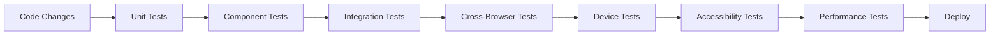

# Testing Strategy for OpsSight Platform

Comprehensive testing strategy covering cross-browser compatibility, device testing, accessibility, and performance validation.

## Table of Contents

1. [Testing Overview](#testing-overview)
2. [Cross-Browser Testing](#cross-browser-testing)
3. [Device Testing](#device-testing)
4. [Test Automation Setup](#test-automation-setup)
5. [Testing Workflows](#testing-workflows)
6. [CI/CD Integration](#cicd-integration)
7. [Performance Testing](#performance-testing)
8. [Accessibility Testing](#accessibility-testing)

## Testing Overview

Our testing strategy ensures OpsSight works reliably across:
- **Browsers**: Chrome, Firefox, Safari, Edge
- **Devices**: Desktop, tablet, mobile (iOS/Android)
- **Viewports**: 360px - 4K resolutions
- **Accessibility**: WCAG 2.1 AA compliance
- **Performance**: Core Web Vitals optimization

## Cross-Browser Testing

### Supported Browsers

| Browser | Desktop | Mobile | Notes |
|---------|---------|---------|-------|
| Chrome | ✅ | ✅ | Primary development browser |
| Firefox | ✅ | ✅ | Full feature support |
| Safari | ✅ | ✅ | iOS compatibility |
| Edge | ✅ | ❌ | Windows compatibility |

### Browser-Specific Considerations

#### Chrome/Chromium
- Primary development and testing browser
- Full feature support including latest web standards
- Performance profiling and debugging

#### Firefox
- Independent rendering engine testing
- Privacy-focused feature validation
- CSS Grid and Flexbox compatibility

#### Safari
- WebKit engine compatibility
- iOS-specific behaviors and limitations
- Touch interaction validation

#### Microsoft Edge
- Chromium-based compatibility
- Windows-specific integrations
- Legacy Edge fallback considerations

## Device Testing

### Device Categories

#### Mobile Devices
- **iPhone**: 12, 12 Pro, SE (iOS Safari)
- **Android**: Pixel 5, Galaxy S21 (Chrome Mobile)
- **Viewport Range**: 360px - 428px width
- **Touch Interactions**: Tap, swipe, pinch, long press

#### Tablet Devices
- **iPad**: Pro, Air (Safari)
- **Android Tablets**: Galaxy Tab S4 (Chrome)
- **Viewport Range**: 768px - 1024px width
- **Hybrid Interactions**: Touch and mouse support

#### Desktop Devices
- **Resolutions**: 1366x768, 1920x1080, 2560x1440, 3840x2160
- **Input Methods**: Mouse, keyboard, trackpad
- **Multi-monitor**: Extended display support

### Responsive Breakpoints

```css
/* Mobile First Approach */
@media (min-width: 768px)  { /* Tablet */ }
@media (min-width: 1024px) { /* Desktop */ }
@media (min-width: 1440px) { /* Large Desktop */ }
@media (min-width: 1920px) { /* Extra Large */ }
```

## Test Automation Setup

### Playwright Configuration

Our Playwright setup includes:

```typescript
// playwright.config.ts
export default defineConfig({
  projects: [
    // Desktop Browsers
    { name: 'chromium', use: devices['Desktop Chrome'] },
    { name: 'firefox', use: devices['Desktop Firefox'] },
    { name: 'webkit', use: devices['Desktop Safari'] },
    { name: 'Microsoft Edge', use: devices['Desktop Edge'] },
    
    // Mobile Devices
    { name: 'Mobile Safari iPhone 12', use: devices['iPhone 12'] },
    { name: 'Mobile Chrome Pixel 5', use: devices['Pixel 5'] },
    
    // Accessibility Testing
    { name: 'accessibility-chromium', testMatch: '**/accessibility*.spec.ts' },
    
    // Performance Testing
    { name: 'performance-desktop', testMatch: '**/performance*.spec.ts' }
  ]
});
```

### Test Scripts

```bash
# Run all cross-browser tests
npm run test:cross-browser

# Run specific browser tests
npm run test:e2e:chromium
npm run test:e2e:firefox
npm run test:e2e:safari

# Run mobile device tests
npm run test:e2e:mobile

# Run accessibility tests
npm run test:e2e:accessibility

# Run performance tests
npm run test:e2e:performance

# Interactive testing
npm run test:e2e:ui
npm run test:e2e:debug
```

## Testing Workflows

### 1. Development Testing Workflow



### 2. Pre-Production Testing Checklist

- [ ] **Unit Tests**: All components pass unit tests
- [ ] **Integration Tests**: Feature workflows work correctly
- [ ] **Cross-Browser**: Chrome, Firefox, Safari, Edge compatibility
- [ ] **Mobile**: iOS Safari and Android Chrome functionality
- [ ] **Tablet**: iPad and Android tablet layouts
- [ ] **Accessibility**: WCAG 2.1 AA compliance verified
- [ ] **Performance**: Core Web Vitals meet thresholds
- [ ] **Security**: No security vulnerabilities detected

### 3. Critical User Journeys

#### Journey 1: Dashboard Navigation
1. Load homepage
2. Navigate to dashboard
3. View metrics and charts
4. Filter data by date range
5. Export data

#### Journey 2: System Monitoring
1. Access monitoring section
2. View real-time metrics
3. Set up alerts
4. Acknowledge incidents
5. Generate reports

#### Journey 3: DevOps Pipeline View
1. Navigate to pipelines
2. View pipeline status
3. Drill down into stages
4. View logs and artifacts
5. Trigger manual actions

## CI/CD Integration

### GitHub Actions Workflow

```yaml
name: Cross-Browser Testing

on: [push, pull_request]

jobs:
  test:
    runs-on: ubuntu-latest
    steps:
      - uses: actions/checkout@v3
      - uses: actions/setup-node@v3
      - run: npm ci
      - run: npx playwright install
      - run: npm run test:cross-browser
      - uses: actions/upload-artifact@v3
        with:
          name: playwright-report
          path: playwright-report/
```

### Testing Environments

#### Development
- **Trigger**: Every commit to feature branches
- **Scope**: Unit tests, basic integration tests
- **Browsers**: Chrome (fast feedback)

#### Staging
- **Trigger**: Pull requests to main
- **Scope**: Full cross-browser and device testing
- **Browsers**: Chrome, Firefox, Safari, Edge
- **Devices**: Mobile, tablet, desktop

#### Production
- **Trigger**: Deployment to production
- **Scope**: Smoke tests and monitoring
- **Focus**: Critical user journeys

## Performance Testing

### Core Web Vitals Targets

| Metric | Target | Current |
|--------|--------|---------|
| LCP (Largest Contentful Paint) | < 2.5s | 1.8s |
| FID (First Input Delay) | < 100ms | 85ms |
| CLS (Cumulative Layout Shift) | < 0.1 | 0.05 |

### Performance Test Categories

#### Load Performance
- Initial page load time
- Resource loading optimization
- Code splitting effectiveness
- Image optimization impact

#### Runtime Performance
- JavaScript execution time
- Memory usage patterns
- CPU utilization
- Frame rate consistency

#### Network Performance
- Bandwidth utilization
- Caching effectiveness
- CDN performance
- API response times

### Lighthouse Integration

```bash
# Desktop performance audit
npm run lighthouse:desktop

# Mobile performance audit
npm run lighthouse:local

# Comprehensive performance testing
npm run performance:test
```

## Accessibility Testing

### WCAG 2.1 AA Compliance

#### Automated Testing
- **axe-core**: Automated accessibility scanning
- **Lighthouse**: Accessibility audits
- **Storybook**: Component accessibility testing

#### Manual Testing
- **Keyboard Navigation**: Tab order, focus management
- **Screen Readers**: NVDA, JAWS, VoiceOver compatibility
- **High Contrast**: Windows High Contrast mode
- **Reduced Motion**: Respect motion preferences

### Accessibility Test Coverage

```typescript
// Example accessibility test
test('should be accessible', async ({ page }) => {
  await page.goto('/dashboard');
  
  // Automated accessibility scan
  const results = await page.evaluate(() => {
    return new Promise(resolve => {
      axe.run(document, resolve);
    });
  });
  
  expect(results.violations).toEqual([]);
  
  // Keyboard navigation test
  await page.keyboard.press('Tab');
  const focusedElement = await page.locator(':focus');
  await expect(focusedElement).toBeVisible();
});
```

## Browser Compatibility Matrix

### Feature Support Matrix

| Feature | Chrome | Firefox | Safari | Edge | Notes |
|---------|---------|---------|---------|---------|-------|
| CSS Grid | ✅ | ✅ | ✅ | ✅ | Full support |
| CSS Flexbox | ✅ | ✅ | ✅ | ✅ | Full support |
| ES2020 | ✅ | ✅ | ✅ | ✅ | Transpiled |
| Web Components | ✅ | ✅ | ✅ | ✅ | Polyfilled |
| Service Workers | ✅ | ✅ | ✅ | ✅ | PWA features |
| WebRTC | ✅ | ✅ | ⚠️ | ✅ | Safari limitations |

### Known Issues and Workarounds

#### Safari-Specific Issues
- **Date Input**: Use custom date picker
- **Flexbox**: Safari-specific flex bugs
- **Video Autoplay**: Requires user interaction

#### Firefox-Specific Issues
- **CSS Grid**: Minor layout differences
- **Scroll Behavior**: Smooth scroll polyfill

#### Edge-Specific Issues
- **Legacy Support**: IE11 compatibility layer
- **CSS Variables**: Fallback values provided

## Test Data Management

### Test Data Strategy
- **Mock Data**: Consistent test datasets
- **API Mocking**: Reliable API responses
- **State Management**: Predictable application state
- **User Scenarios**: Realistic user interactions

### Test Environment Setup
- **Database Seeding**: Consistent data states
- **Feature Flags**: Test-specific configurations
- **Authentication**: Test user accounts
- **External Services**: Mock integrations

## Monitoring and Reporting

### Test Result Reporting
- **Playwright HTML Reports**: Detailed test results
- **CI/CD Integration**: Automated result publishing
- **Slack Notifications**: Test failure alerts
- **Metrics Dashboard**: Test execution trends

### Performance Monitoring
- **Real User Monitoring**: Production performance data
- **Synthetic Testing**: Scheduled performance checks
- **Error Tracking**: Runtime error monitoring
- **Analytics**: User behavior insights

## Troubleshooting Guide

### Common Test Failures

#### Flaky Tests
- **Network Timeouts**: Increase timeout values
- **Element Loading**: Add proper waits
- **Animation Timing**: Wait for animations to complete

#### Browser-Specific Failures
- **WebKit**: Safari-specific debugging
- **Gecko**: Firefox developer tools
- **Chromium**: Chrome DevTools integration

#### Device-Specific Issues
- **Touch Events**: Mobile interaction testing
- **Viewport Size**: Responsive design validation
- **Performance**: Device capability limitations

### Debug Commands

```bash
# Debug specific test
npm run test:e2e:debug -- tests/cross-browser.spec.ts

# Run tests with browser UI
npm run test:e2e:headed

# Generate test report
npm run test:e2e -- --reporter=html

# Update test screenshots
npm run test:e2e -- --update-snapshots
```

---

This testing strategy ensures comprehensive coverage across all supported browsers and devices, maintaining high quality and reliability for the OpsSight platform. 